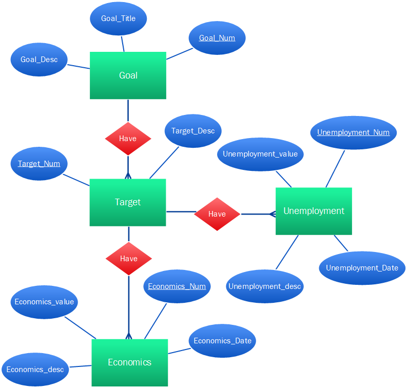
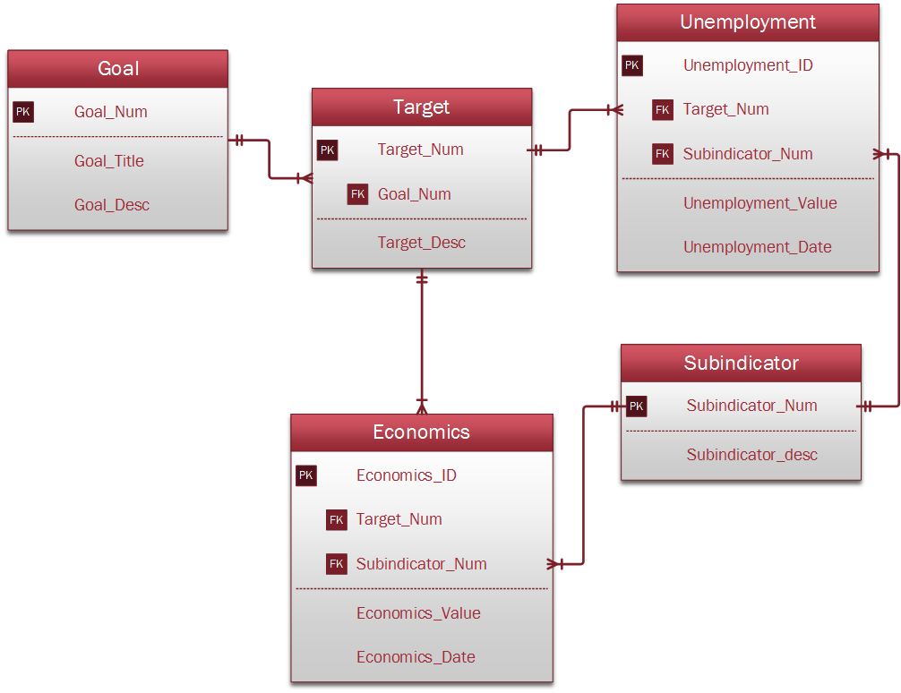
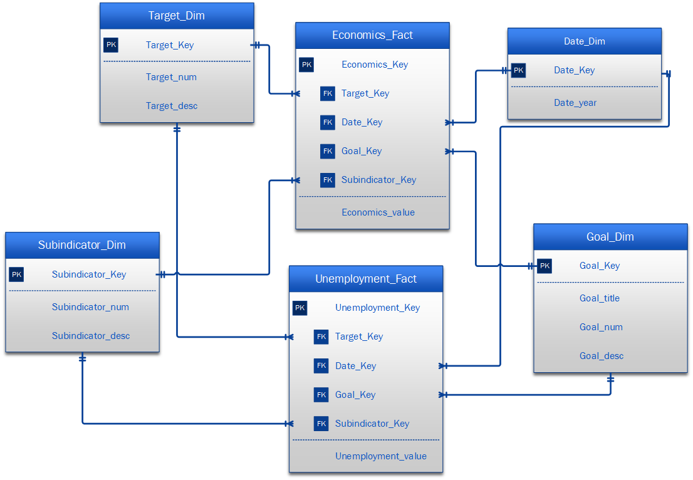

# Data Modeling: Philippine Sustainable Development Goal

Modeling data related to Philippine Sustainable Development Goals means finding ways to understand and improve the country's progress toward long-term goals like reducing poverty and promoting good health. By using data and models, we can make better decisions to create a sustainable and positive impact on the Philippines' development.

### Entity-Relationship Diagram

### Normalized Model

### Dimensional Model

